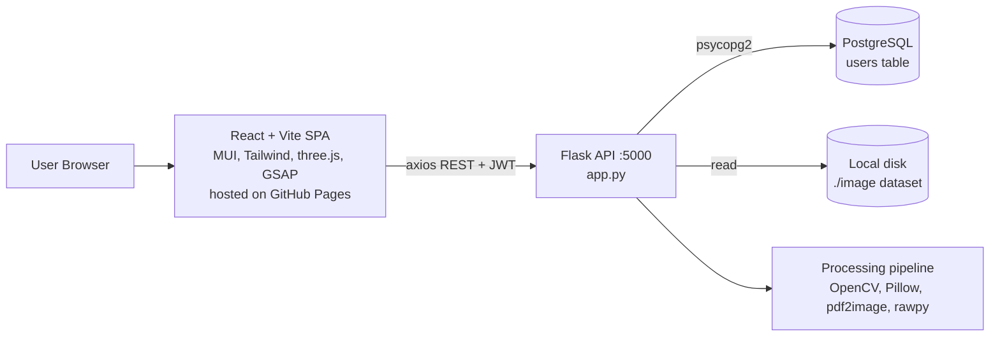
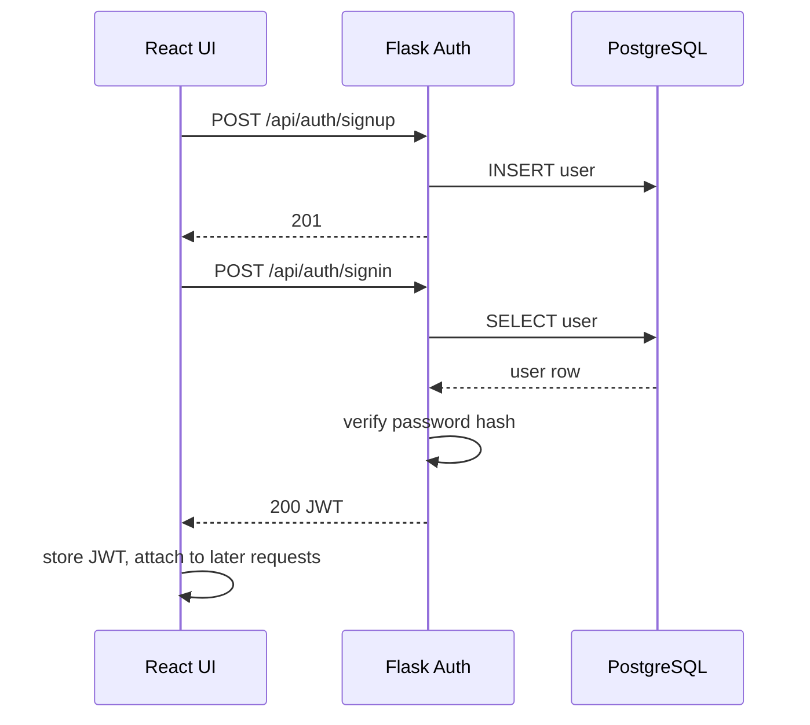
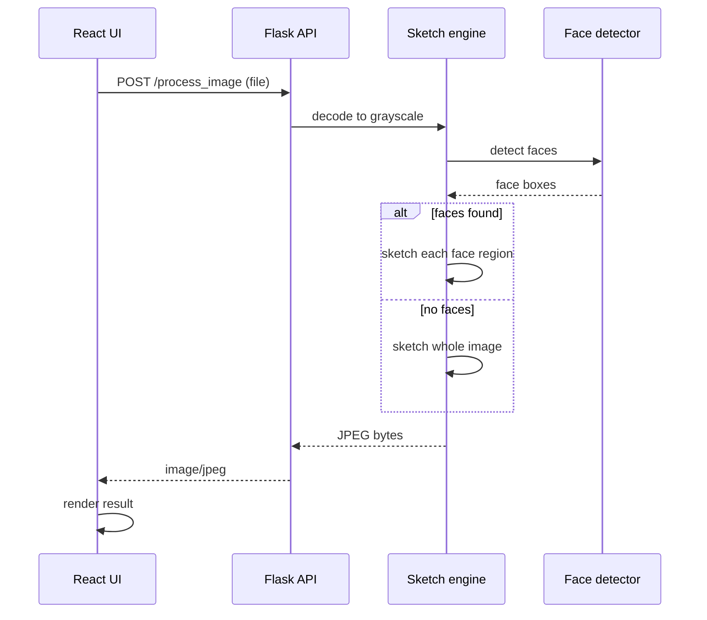
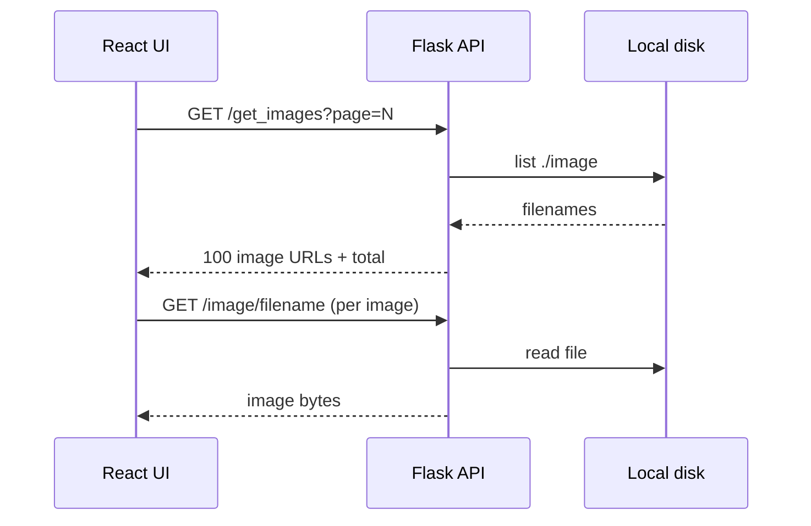
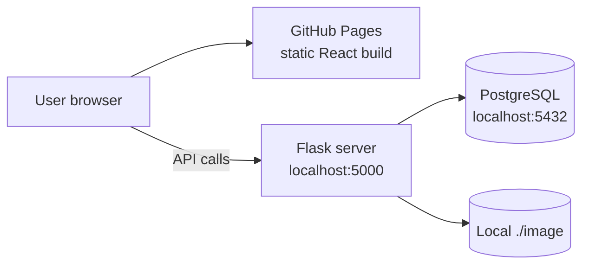
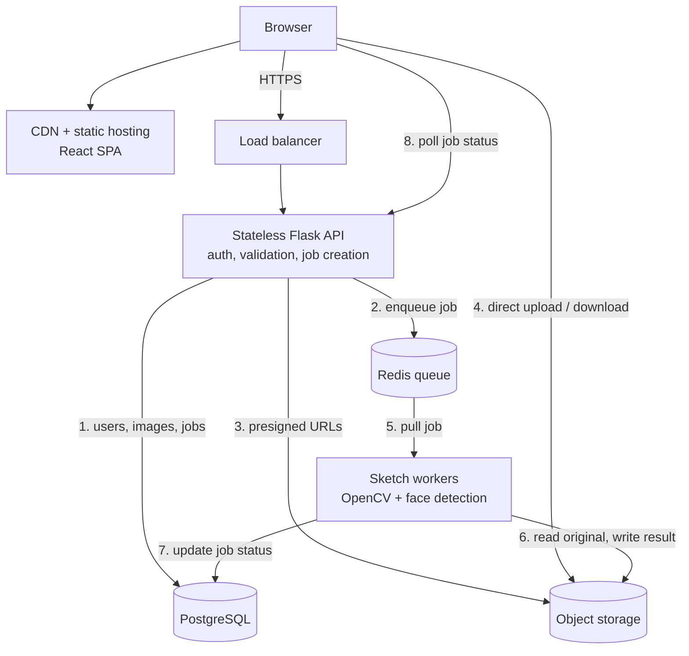
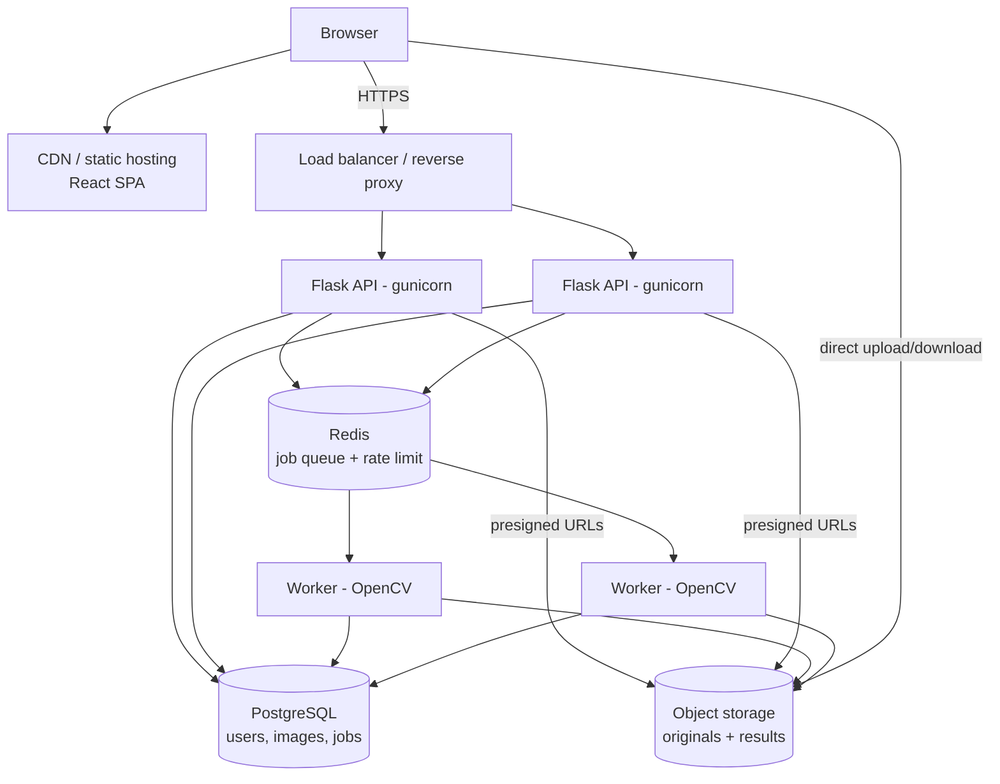
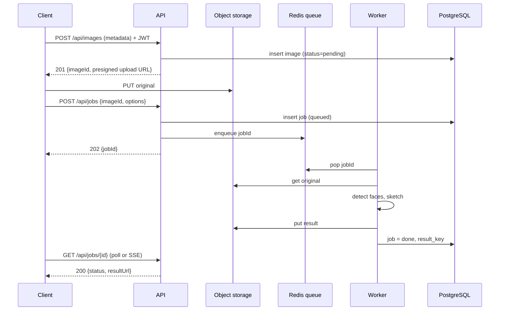
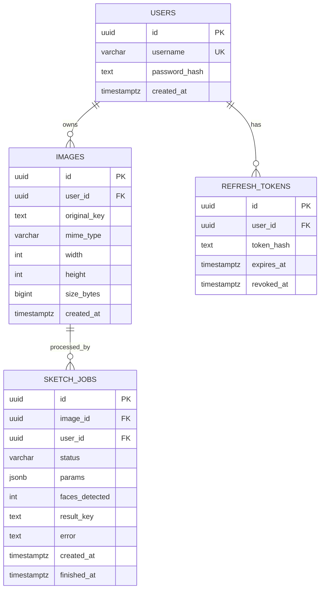

# Sketchify
Image-to-pencil-sketch web app. Users sign up, upload an image, and get back a sketch. Faces are detected and sketched selectively.

- **Part A — As built:** what the repository does today.
- **Part B — Target design:** how I would evolve it for production scale.

---

## Requirements

**Functional**

- Sign up / sign in with JWT auth
- Upload an image and receive a sketch version
- Detect faces and apply the sketch effect to face regions
- Browse a gallery of images (paginated)
- Support multiple input formats (PNG, JPG, GIF, TIFF, PSD, PDF, RAW)

**Non-functional**

- Low-latency response for a single image (target p95 < 3 s)
- CPU-heavy work must not block the API
- Passwords and tokens stored and handled securely
- Horizontally scalable, stateless API
- Cheap to run (pay for compute only when processing)

**Out of scope (for now):** payments, social sharing, video, GPU/ML style transfer.

---

## Part A — Architecture as built



**Components**

- **Frontend:** React 18 SPA built with Vite, React Router, MUI + Tailwind, three.js / react-three-fiber for 3D visuals, GSAP animation, react-webcam for camera capture. Deployed to GitHub Pages.
- **Backend:** single Flask process (`app.py`) with Flask-CORS and Flask-JWT-Extended. Handles auth, image serving, and image processing in the same request thread.
- **Database:** PostgreSQL, accessed with raw `psycopg2` (no ORM, no connection pool).
- **Storage:** local filesystem folder `./image`.

### Image processing algorithm

Pencil-sketch via the "colour dodge" technique:

1. Decode to grayscale.
2. Invert the image (`255 - img`).
3. Gaussian blur the inverted image (kernel 21×21).
4. Invert the blurred image.
5. Divide the grayscale image by the inverted blur (`cv2.divide(..., scale=256)`).

Face handling: Haar cascade (`haarcascade_frontalface_default`) detects faces; the sketch is applied to each face region, and to the whole image when no face is found.

---
### Interaction table
 
| # | From | To | Protocol | Purpose | Payload |
|---|---|---|---|---|---|
| 1 | React UI (axios) | Flask API | HTTP/JSON, multipart | Auth, upload, gallery | credentials, image file, JWT header |
| 2 | Auth module | PostgreSQL | SQL via psycopg2 | Create user, look up user | username, password hash |
| 3 | Image routes | Local disk | File I/O | List and serve dataset images | filenames, bytes |
| 4 | Sketch engine | Face detector | In-process call | Find face regions | grayscale array → boxes |
| 5 | Sketch engine | Image routes | In-process return | Deliver processed image | JPEG bytes |
| 6 | Flask API | React UI | HTTP | Response | JSON or `image/jpeg` |
 
---
 
## Key flows
 
### Sign up and sign in


 
### Convert an image to a sketch
 ---

 
### Gallery
 ---

 
---
 
## Deployment view (as built)
 

 
- Frontend: `vite build` then `gh-pages -d dist`.
- Backend and DB: run on one machine; the API URL is hardcoded to `localhost:5000` in gallery responses.
---
 
## Target HLD (production)
 

### API surface (current)

| Method | Path | Auth | Purpose |
|---|---|---|---|
| POST | `/api/auth/signup` | none | Create user |
| POST | `/api/auth/signin` | none | Return JWT |
| GET | `/protected` | JWT | Auth check example |
| POST | `/process_image` | none | Upload → sketch (sync) |
| GET | `/get_images?page=` | none | Paginated dataset listing (100/page) |
| GET | `/image/<filename>` | none | Serve dataset image |
| GET | `/process_dataset` | none | Batch-process whole folder |
| GET | `/test_db` | none | Debug: dumps `users` table |

### Current database

One table, `users`, with a username and a password column. No other persistence: images and results are not tracked in the database.

### Known issues in the current build

Fix these before presenting the project. Interviewers who open the repo will see them.

**Security (critical)**

1. **Secrets committed to a public repo:** the JWT signing key and a database URL with password are hardcoded in `app.py`, and `.env` is tracked. Rotate both, remove the values from code, add `.env` to `.gitignore`, and purge them from git history (`git filter-repo` or BFG).
2. **Signup stores the plaintext password**, while sign-in verifies with `check_password_hash`. Newly registered users cannot log in, and the DB holds raw passwords. Hash on signup with `generate_password_hash`.
3. **`/test_db` returns every row of `users`** (including passwords) to anyone. Remove it.
4. `debug=True` and `host=0.0.0.0` expose the Werkzeug debugger. Use gunicorn in production with debug off.
5. Open CORS, no rate limiting, no upload size or type limits, no auth on processing endpoints.

**Correctness / design**

6. `detect_faces` draws the rectangle into the image in place, so the box is baked into the output.
7. When faces are found, only the face regions are sketched; the rest of the image stays plain grayscale.
8. `/process_dataset` loops the whole folder in one request and returns only filenames (the processed bytes are discarded).
9. `get_images` hardcodes `http://localhost:5000` in returned URLs.
10. Each request opens a new DB connection (no pool). Files in `./image` live on the app server's disk, so the API is not stateless.
11. `tempCodeRunnerFile.py` is committed; the root has no real README (Vite template text).

---

## Part B — Target design

### Capacity estimate

Assumptions (stated so they can be challenged):

- 1,000 daily active users, 5 images each → 5,000 jobs/day
- Average rate ≈ 0.06 req/s; peak at 10× ≈ 0.6 req/s
- ~0.3 s CPU per 2 MP image (to be measured)
- Original ≈ 2 MB, result ≈ 0.5 MB → ~12.5 GB/day; 30-day retention ≈ 375 GB

Takeaways:

- Throughput is low, but each request is CPU-bound and blocks a web worker. That is the reason to separate processing from the API, not raw QPS.
- Storage is the main cost driver → object storage with lifecycle rules, not local disk or the database.

### Architecture



**Why each piece**

- **Stateless API:** validates, authenticates, creates a job row, enqueues. Scales by adding instances.
- **Queue + workers:** CPU work is isolated; workers scale independently and failed jobs can be retried.
- **Object storage + presigned URLs:** the client uploads/downloads directly, so large files never pass through the API.
- **PostgreSQL:** relational data (users, ownership, job status) with strong consistency.
- **Redis:** queue broker and rate-limit counters.
- **CDN:** static SPA and cached result images.

###  Async processing flow



### Data model



```sql
CREATE TABLE users (
  id            UUID PRIMARY KEY DEFAULT gen_random_uuid(),
  username      VARCHAR(50) UNIQUE NOT NULL,
  password_hash TEXT NOT NULL,
  created_at    TIMESTAMPTZ NOT NULL DEFAULT now()
);

CREATE TABLE images (
  id           UUID PRIMARY KEY DEFAULT gen_random_uuid(),
  user_id      UUID NOT NULL REFERENCES users(id) ON DELETE CASCADE,
  original_key TEXT NOT NULL,
  mime_type    VARCHAR(50) NOT NULL,
  width        INT,
  height       INT,
  size_bytes   BIGINT,
  created_at   TIMESTAMPTZ NOT NULL DEFAULT now()
);
CREATE INDEX idx_images_user_created ON images (user_id, created_at DESC);

CREATE TABLE sketch_jobs (
  id             UUID PRIMARY KEY DEFAULT gen_random_uuid(),
  image_id       UUID NOT NULL REFERENCES images(id) ON DELETE CASCADE,
  user_id        UUID NOT NULL REFERENCES users(id) ON DELETE CASCADE,
  status         VARCHAR(12) NOT NULL DEFAULT 'queued'
                 CHECK (status IN ('queued','processing','done','failed')),
  params         JSONB NOT NULL DEFAULT '{}',
  faces_detected INT,
  result_key     TEXT,
  error          TEXT,
  created_at     TIMESTAMPTZ NOT NULL DEFAULT now(),
  finished_at    TIMESTAMPTZ
);
CREATE INDEX idx_jobs_user_created ON sketch_jobs (user_id, created_at DESC);
CREATE INDEX idx_jobs_pending ON sketch_jobs (status) WHERE status IN ('queued','processing');
```

**Design choices**

- UUID keys avoid enumerable IDs in URLs.
- Only object keys are stored in the DB; binaries live in object storage.
- Composite `(user_id, created_at DESC)` indexes serve the gallery query; keyset pagination replaces `OFFSET`.
- Partial index keeps the "pending jobs" lookup small.
- `params` as JSONB lets sketch options (blur kernel, face-only, etc.) evolve without migrations.

###  API (target)

| Method | Path | Auth | Purpose |
|---|---|---|---|
| POST | `/api/auth/signup` | none | Create user (hashed password) |
| POST | `/api/auth/signin` | none | Access + refresh token |
| POST | `/api/auth/refresh` | refresh | New access token |
| POST | `/api/images` | JWT | Register image, get upload URL |
| POST | `/api/jobs` | JWT | Enqueue sketch job |
| GET | `/api/jobs/{id}` | JWT | Status + result URL |
| GET | `/api/images?cursor=` | JWT | User gallery (keyset pagination) |
| DELETE | `/api/images/{id}` | JWT | Delete image and results |
| GET | `/healthz` | none | Liveness / readiness |

### Security

- Passwords: Argon2 or bcrypt hashing, never logged
- Secrets from environment / secret manager; `.env` never committed
- Short-lived access token (15 min) + rotating refresh token
- Rate limiting per IP and per user (Redis)
- Upload validation: MIME sniffing, max size, max dimensions; decode in a sandboxed worker
- CORS restricted to the deployed frontend origin
- Parameterized queries only (already the case)
- Presigned URLs with short expiry and per-user key prefixes

### Scalability and reliability

- **API:** stateless, scale horizontally behind the load balancer
- **Workers:** autoscale on queue depth
- **DB:** connection pooling (PgBouncer), read replica if gallery reads grow
- **Retries:** exponential backoff, dead-letter queue for poison images
- **Idempotency:** job keyed by `(image_id, params hash)` so re-submits don't double-process
- **Cleanup:** object-storage lifecycle rule deletes originals/results after N days
- **Observability:** structured logs, request IDs, metrics (queue depth, job latency, failure rate)

### Trade-offs

| Decision | Chosen | Alternative | Why |
|---|---|---|---|
| Processing | Async queue | Sync in request | Isolates CPU work, enables retries |
| Storage | Object storage | Postgres BYTEA / local disk | Cheap, scalable, CDN-friendly |
| Database | PostgreSQL | MongoDB | Relational ownership + transactional job state |
| Auth | JWT + refresh | Server sessions | Stateless API; refresh tokens allow revocation |
| Job status | Polling (SSE later) | WebSockets | Simplest that works at this scale |
| Filter | Classical OpenCV | ML style-transfer | No GPU needed, deterministic, fast |

---

## Roadmap

1. **Now:** rotate secrets, fix signup hashing, remove `/test_db`, add real README
2. **Next:** `images` + `sketch_jobs` tables, move files to object storage, gunicorn + Docker
3. **Then:** Redis queue + workers, presigned uploads, rate limiting
4. **Later:** CDN, SSE progress, additional sketch styles, optional DNN-based face detection
